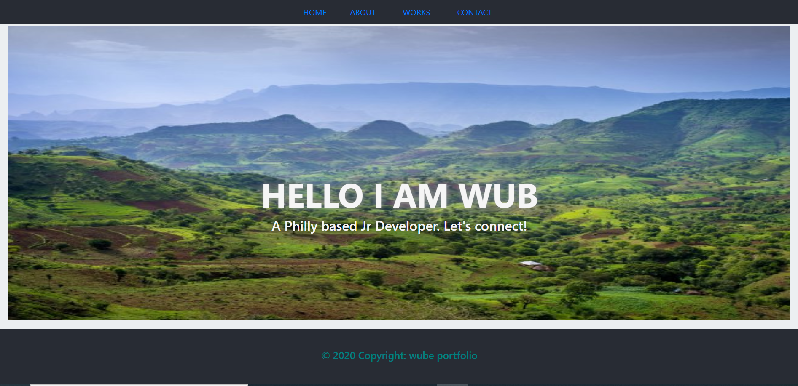
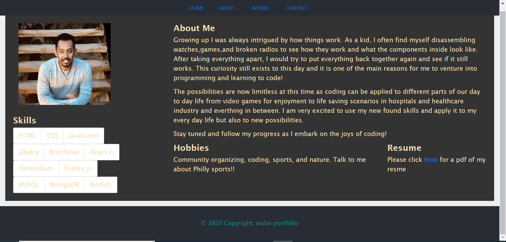
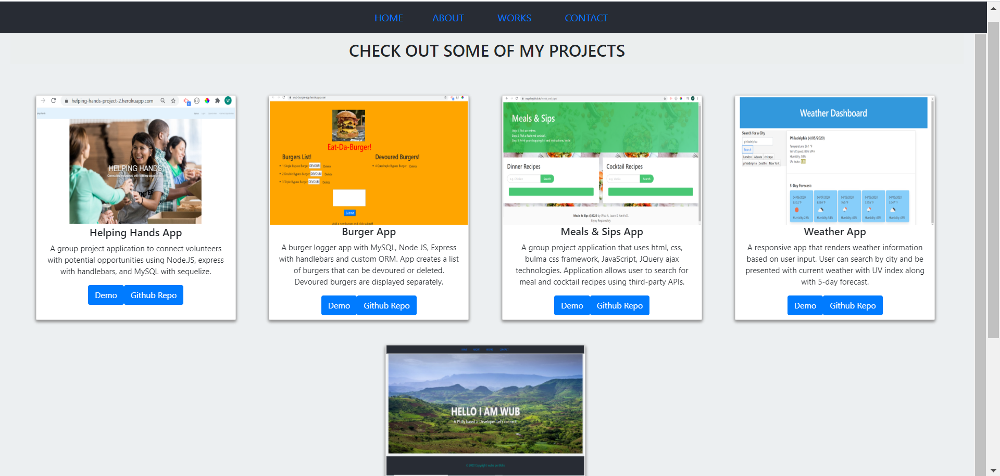

# react-portfolio

## Table of Contents
<!--ts-->
   * [Project Description](#project-description)
   * [Technologies Used](#technologies-used) 
   * [Dependencies](#dependencies)
   * [Tests](#tests)
   * [Using Repo](#using-repo)
   * [Contributing to the repo](#contributing-to-the-repo)
   * [Licenses](#licenses)
   * [Inquiries](#inquiries)
   * [Developer Info](#developer-info)
<!--te-->
## Project Description
A front-end react based portfolio that uses react router, props, and components. Porfolio shows basic info and highlights recent projects along with contact information

Project url: 
(https://github.com/wayele/react-portfolio)

## Screenshots
Home page 
About page 
Works page 
## Technologies Used
HTML, JavaScript, Bootstrap, ReactJs

## Dependencies
npm start
## Tests
NA
## Using Repo
npm start to start the application
## Contributing to the repo
Input to improve functionality and efficiency of the application is welcomed
## Licenses

MIT
## Inquiries
Yes

ayele.wub@gmail.com
## Developer Info:

Github username: wayele

Email: ayele.wub@gmail.com
